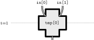
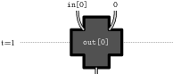
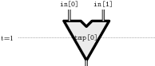
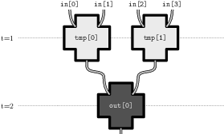
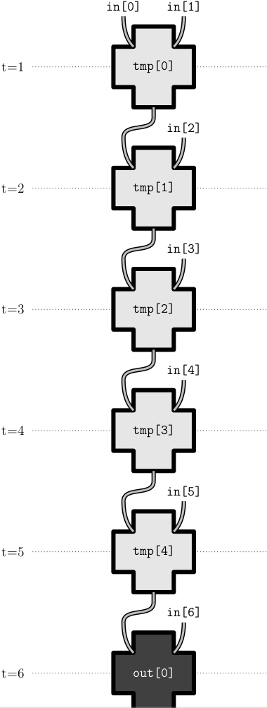
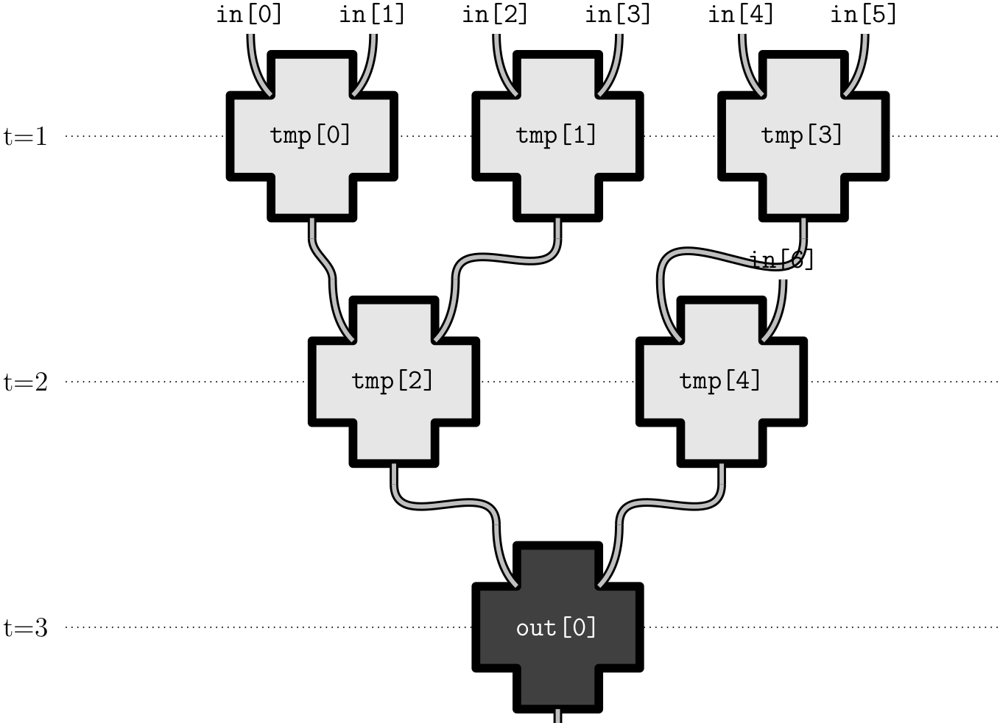
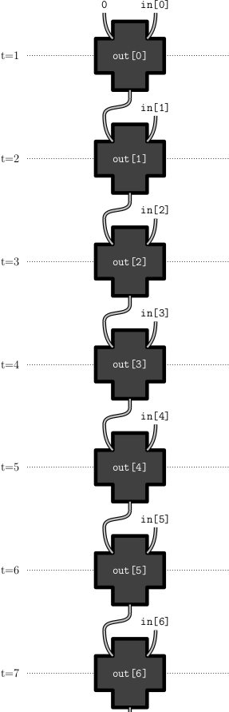
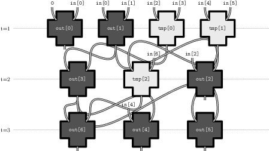
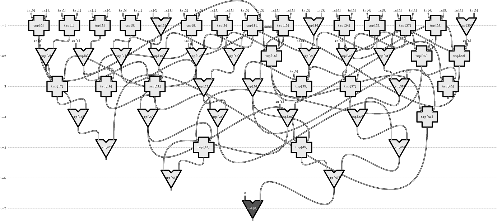

# Circuiti oii 2018

[Circuiti](https://training.olinfo.it/#/task/oii_circuiti/statement) è uno dei 3 task delle nazionali italiane dell'anno 2018. Secondo le [statistiche](https://stats.olinfo.it/task/2018/circuiti) anche il più difficile. In questa guida andremo a risolverlo facendo uso di una delle più semplice e potenti strutture dati: [Segment Tree](https://cp-algorithms.com/data_structures/segment_tree.html). 

## Categoria Output Only 

Circuiti è un problema output only cioè al partecipante viene richiesto solo di generare i file di output dai file di input consegnati. Quindi è possibile utilizzare qualsiasi linguaggio a patto che sia stato installato sulla macchina, come per esempio: C, C++, Java e Python. Questo tipo di valutazione apre altre strade per il risolutore permettendo una serie di vantaggi. Il più importante è che non si deve saper necessariamente risolvere l'istanza generale del problema ma solo quelle proposte nei file di input, permettendo la scrittura di soluzioni mirate e euristiche per determinati casi di test. Un'ulteriore vantaggio è dato dalla risorse "illimitate" per la soluzione del problema, non si è legati a rispettare vincoli di tempi d'esecuzione e di memoria. Bisogna però prestar attenzione che il tempo potrebbe essere vincolato dalla durata della gara e la memoria da quella che effettivamente il pc possiede. Una strategia che potrebbe adottare il risolutore potrebbe essere una soluzione a forza bruta che risolva più casi di test possibili per il tempo rimasto in modo tale da aggiudicarsi punti. È consigliato scrivere un programma che apre e chiude i file in modo tale da poter usufruire dell'output anche se il programma termini per una qualsiasi ragione. In casi più estremi in cui potrebbe non essere chiara una strategia è possibile risolvere  a mano, scrivendo su file di testo da qualsiasi editor  la soluzione di quel caso in modo da guadagnare punti. Nella guida noterete che le soluzioni naive prenderanno pochissimi punti quando un test case risolto correttamente a mano può garantire la bellezza di `10` pt.  Lo scarto di pochi punti può fare la differenza tra vincere o no!

### Visualizer

Nella categoria output only potrebbe essere fornito insieme ai file di input un visualizer, che permette di visualizzare effettivamente l'output prodotto. Nelle macchina messe a disposizione nelle gare ci sono già installati i software necessari, mentre se lo si sta provando fuori gara si ha bisogno di: 

*  [LaTex](https://www.latex-project.org/get/)
* [Asymptote](http://asymptote.sourceforge.net/)
* [Python3](https://www.python.org/downloads/)
* [zenity](https://pkgs.org/download/zenity) (linux), [zenity](https://github.com/kvaps/zenity-windows)(Windows, seguire la procedura indicata)
* YAD (opzionale)

Per utilizzare il visualizer si può utilizzare lo script in bash fornito oppure una lista di comandi shell:

```bash
py visualize.py < output.txt > vis.asy
asy -f pdf vis.asy
```

Proseguendo la guida troverete delle immagine generate dal visualizer.

## Traccia

Il problema richiede di realizzare 3 tipi diversi di circuiti: Somma, Prefissi, Massimo sottoarray. Per realizzare un circuito abbiamo a disposizione componenti e registri. I registri ci permettono di interfacciarci con l'input del circuito e con l'output; rispettivamente i registri di input vengono segnati con il nome  *`in[]`* , quelli di output vengono segnati con il nome *`out[]`*. Le componenti possono essere utilizzate come dei registri intermedi. I registi intermedi e quelli di output sono formati da esattamente **solo 2** ingressi. I registi intermedi hanno a disposizione infinite uscite mentre quelli di output **solo una**.  I registri quindi **sono** dei **vettori** indicizzati da `0` a `N - 1` (dove *N* è la dimensione del registro). Per combinare i registri abbiamo a disposizione **3** operazioni: somma, sottrazione e massimo. In una combinazione il risultato deve essere dato da **esattamente 2 ingressi** e ha un **solo output**. Gli ingressi posso essere benissimo altri registri o costanti intere.  Nella realizzazione dei circuiti dobbiamo rispettare determinati vincoli. Non dobbiamo utilizzare più di `1100` componenti (da questo numero sono esclusi i registri di input e output) e non dobbiamo utilizzare più di ***C*** unità di tempo chiamate cicli. Nella *i*-esima unità di tempo vengono utilizzate solo le componenti calcolate nelle scorse unità di tempo. 

### Formato dell'input

Per conoscere il tipo di circuito dobbiamo leggere un'unica riga.

Riga(1): i 3 interi *T*, *N*, *C*. Rispettivamente il tipo di circuito da realizzare, la dimensione del registro di input e il tempo massimo di calcolo.

| T    | Tipo               |
| ---- | ------------------ |
| 1    | Somma              |
| 2    | Prefissi           |
| 3    | Massimo sottoarray |


### Formato dell'output

Per realizzare effettivamente un circuito dobbiamo produrre un file di testo in cui ci sono le operazioni da effettuare. Un'operazione può essere cosi descritta:
$$
C[k] = A[i] \text{ op } B[i] \\
C[k] = i  \text{ op } B[i] \\
C[k] = A[i]  \text{ op } j \\
$$

* I vettori *A*,*B*,*C* sono nomi di array. Questi nomi possono essere composti da massimo 50 caratteri alfanumerici (maiuscoli o minuscoli), e non devono cominciare con una cifra
* I valori *i*,*j*,*k* sono costanti intere positive, che devono stare in un intero a 32 bit con segno.
* op è un operatore a scelta fra `+`,`-` o `max`

Esempi:

| Codice                                                   | Effetto                             |
| -------------------------------------------------------- | ----------------------------------- |
| `tmp[0] = in[0] + in[1]`                                 |         |
| `out[0] = in[0] + 0`                                     |         |
| `tmp[0] = in[0] max in[1]`                               |       |
| `tmp[0] = in[0] + in[1]`<br />`tmp[2] = tmp[0] + tmp[1]` | Errore: tmp[1] non è stato definito |

 Combinando i registri si definiscono i nuovi che saranno pronti per l'unità di tempo successiva. L'unità successiva corrisponderà al massimo delle unità dei tempo dei registri usati più uno.

### Esempio input/output

| input   | output                                                       |
| ------- | ------------------------------------------------------------ |
| `1 4 3` | `tmp[0] = in[0] + in[1]`<br/>`tmp[1] = in[2] + in[3]`<br/>`out[0] = tmp[0] + tmp[1]` |

Il risultato del visualizer del primo input.



## Funzioni ausiliare

Prima di iniziare la risoluzione del problema consiglio di sviluppare 3 funzioni con dei relativi assert per evitare che si sommino valori non validi.

1. newVar: Dovrà restituire il nome di un nuovo registro intermedio.
2. ADD: Dati in input 3 componenti *A*,*B*,*C* dovrà immagazzinare in *A* la somma tra *B* e C stampando l'operazione su file.
3. MAX: Dati in input 3 componenti  *A*,*B*,*C* dovrà immagazzinare in *A* il massimo tra *B* e *C* stampando l'operazione su file.

Questo è un piccolo grader realizzato da me per leggere e scrivere su file utilizzando stdin e stdout con le funzione prima elencate. Il codice si aspetta di trovare i file di input nella cartella in cui viene eseguito. 

```c++
#include <bits/stdc++.h>

using namespace std;

// Ausilio Globale
const int MAXN = 1e4;
int numero_componente = 0;


string newVar(){
	string ret = "tmp[" + to_string(numero_componente) + "]";
	numero_componente++;
	return ret;
}

void ADD(string A, string B, string C){
	assert(A != "x" && B != "x" && C != "x");
	string ret = A + " = " + B + " + " + C + '\n';
	cout << ret;
}

void MAX(string A, string B, string C){
	assert(A != "x" && B != "x" && C != "x");
	string ret = A + " = " + B + " max " + C + '\n';
	cout << ret;
}

void somma(int N, int C){
	// inserisci qui il codice per risolvere le somme
    // ricordati di azzerare le variabili globali!
    numero_componente = 0;
	return;
}

void prefissi(int N, int C){
	// inserisci qui il codice per risolvere i prefissi
    // ricordati di azzerare le variabili globali!
    numero_componente = 0;
	return;
}

void massimo_sottoarray(int N, int C){
	// inserisci qui il codice per risolvere il massimo sotto array
    // ricordati di azzerare le variabili globali!
    numero_componente = 0;
	return;
}

int main(){
	for(int i = 0; i < 10; i++){
		string File_in = "input_00" + to_string(i) + ".txt";
		string File_out = "output_00" + to_string(i) + ".txt";
		FILE *fr = freopen(File_in.c_str(), "r", stdin);
		FILE *fw = freopen(File_out.c_str(), "w", stdout);
		// mi assicuro che si aprono i file 
		assert(fr != NULL);
		assert(fw != NULL);
		// leggo 
		int T, N, C;
		cin >> T >> N >> C;
		switch(T){
			case 1: somma(N,C);break;
			case 2: prefissi(N,C);break;
			case 3: massimo_sottoarray(N,C);break;
			default: cout << "Nessuna scelta \n"; assert(false);break;
		}
		// chiudo i file
		fclose(fr);
		fclose(fw);
	}
	return 0;
}
```

## Somma 30pt 

Per realizzare il circuito di somma dobbiamo realizzare la somma di tutte le componenti date in ingresso. La tabella dei file di input:

| Nome file     | N    | C    |
| ------------- | ---- | ---- |
| input_000.txt | 7    | 3    |
| input_001.txt | 256  | 8    |
| input_002.txt | 1093 | 11   |

Una prima soluzione è semplicemente sommare l'*i*-esimo registro con la somma precedente. Cosi avremo come tempo di calcolo ***O(N)*** e uso di processori ***O(N)*** ottenendo  `5.31`pt.  Come illustrato dall'immagine questa strategia non è ottimale per il tempo di calcolo richiesto. 



```c++
void somma(int N, int C){
    numero_componente = 0;
    vector <string> v(N);
    v[0] = "in[0]";
    for(int i = 1; i < N; i++){
    	if(i == N - 1){
    		v[i] = "out[0]";
    	}else{
    		v[i] = newVar();
    	}
    	ADD(v[i], v[i - 1], "in[" + to_string(i) + "]");
    }
	return;
}
```

Per ottenere appieno i `30` pt dobbiamo ridurre il tempo di calcolo. Utilizzando il Segment Tree possiamo calcolare l'intera somma utilizzando un tempo di calcolo ***O( log2(N) )*** con un numero un poco più alto di processori. Notare che con questa strategia utilizziamo esattamente il tempo di calcolo ***C*** richiesto quindi nel nodo che rappresenta l'intero range bisogna utilizzare direttamente il registro *`out[]`*.

Tempo di calcolo: ***O(log<sub>2</sub>(N))***

Numero componenti: ***O(N)***



```c++
// Somma 
// Segment tree per le somme
string segmentSomma[MAXN];

void buildSomma(int node, int s, int e, int N){
	if(s == e){
		segmentSomma[node] = "in[" + to_string(s) + "]";
	}else{
		int lc = node * 2 + 1;
		int rc = node * 2 + 2;
		int mid = s + (e - s) / 2;
		// calcolo prima i figli
		buildSomma(lc, s, mid, N);
		buildSomma(rc, mid + 1, e, N);
		// calcolo il nodo attuale
		// utilizzo direttamente il registro se copro tutto il range
		if(s == 0 && e == N - 1){
			segmentSomma[node] = "out[0]";
		}else{
			segmentSomma[node] = newVar();
		}
		ADD(segmentSomma[node], segmentSomma[lc], segmentSomma[rc]);
	}
}

void somma(int N, int C){
	// inizializzazione
	numero_componente = 0;
	for(string &i : segmentSomma){
		i = "x";
	}
    // eseguo
	buildSomma(0, 0, N - 1, N);
	return;
}
```


## Prefissi 30pt

Per realizzare il circuito prefissi bisogna calcolare ogni somma dall'indice 0 all'indice N - 1. La tabella dei file in input:

| Nome File      | N    | C    |
| -------------- | ---- | ---- |
| output_003.txt | 7    | 5    |
| output_004.txt | 128  | 13   |
| output_005.txt | 371  | 15   |

Una prima soluzione, cosi come per le somme, si computano tutte le somme pian piano ottenendo `8.56` pt.



```c++
void prefissi(int N, int C){
    numero_componente = 0;
    vector <string> v(N);
    v[0] = "out[0]";
    ADD(v[0], "0", "in[0]");
    for(int i = 1; i < N; i++){
    	v[i] = "out[" + to_string(i) + "]";
    	ADD(v[i], v[i - 1], "in[" + to_string(i) + "]");
    }
	return;
}
```

Per ottenere il punteggio massimo dobbiamo utilizzare il Segment Tree, cosi come per le somme lo costruiamo e rispondiamo alla query nativamente. Cosi facendo si ottiene `26.13` pt. Per il punteggio massimo dobbiamo fare due piccole osservazioni:

1. Durante la creazione del Segment Tree si calcolano già determinati prefissi.
2. La somma di un prefisso è data dalla somma di determinati range. Basta calcolarli una volta e non più volte per ogni interrogazione.

Tempo di calcolo: ***O(log2(N))***

Componenti: ***O( N log<sub>2</sub>(N))***



```c++
// Prefissi 
// prefissi già calcolati
bool done[MAXN];
// somme già calcolate
map <vector <int>, string> memo;
// nodi da sommare
vector <int> toAdd;

void buildPrefissi(int node, int s, int e){
	if(s == e){
		segmentSomma[node] = "in[" + to_string(s) + "]";
	}else{
		int lc = node * 2 + 1;
		int rc = node * 2 + 2;
		int mid = s + (e - s) / 2;
		// calcolo prima i figli
		buildPrefissi(lc, s, mid);
		buildPrefissi(rc, mid + 1, e);
		// calcolo il nodo attuale
		// utilizzo direttamente il registro se copro tutto il range
		if(s == 0){
			segmentSomma[node] = "out[" + to_string(e) + "]";
			done[e] = true;
		}else{
			segmentSomma[node] = newVar();
		}
		ADD(segmentSomma[node], segmentSomma[lc], segmentSomma[rc]);
	}
}

// ricavo i nodi da sommare per ottenere il range
void query(int node, int s, int e, int index){
	if(s > index)return;
	if(e <= index){
		toAdd.push_back(node);
	}else{
		int lc = node * 2 + 1;
		int rc = node * 2 + 2;
		int mid = s + (e - s) / 2;
		query(lc, s, mid, index);
		query(rc, mid + 1, e, index);
	}
}

string dp(vector <int> add, string name = ""){
	vector <int> state = add;
	// ho già calcolato questo stato 
	if(memo.find(state) != memo.end())return memo[state];
	// ho solo un elemento
	if(add.size() == 1){
		// se ho un nome allora unisco l'unico nodo
		if(name != ""){
			memo[state] = name;
			ADD(memo[state], name, "0");
			return memo[state];
		}else{
			// altrimenti lo passo alla prossima query
			return segmentSomma[state[0]];
		}
	}
	add.pop_back();
	// se ho il nome lo uso
	if(name != ""){
		memo[state] = name;
	}else{
		memo[state] = newVar();
	}
	ADD(memo[state], segmentSomma[state.back()], dp(add, ""));
	return memo[state];
}

void prefissi(int N, int C){
	// inizializzazione
	numero_componente = 0;
	for(string &i : segmentSomma){
		i = "x";
	}
	for(bool &i : done){
		i = false;
	}
	memo.clear();
	// eseguo
	// caso base
	ADD("out[0]", "0", "in[0]");
	buildPrefissi(0, 0, N - 1);
	for(int i = 1; i < N; i++){
		// ho calcolato precedentemente il prefisso che finisce in i
		if(done[i])continue;
		// ottengo i nodi da sommare
		query(0, 0, N - 1, i);
		// prendo il registro di out
		string cur = "out[" + to_string(i) + "]";
		// sommo 
		dp(toAdd,cur);
		// pulisco la lista
		toAdd.clear();
	}
	return;
}
```

Un esempio di alcuni nodi interpellati per ogni prefisso dal secondo caso di test:

```
[63, 129]
[31, 131]
[31, 65]
[31, 65, 133]
[15, 135]
[15, 67]
[15, 67, 137]
[15, 33]
[15, 33, 139]
[15, 33, 69]
[15, 33, 69, 141]
[7, 143]
[7, 71]
[7, 71, 145]
[7, 35]
[7, 35, 147]
[7, 35, 73]
[7, 35, 73, 149]
[7, 17]
[7, 17, 151]
[7, 17, 75]
[7, 17, 75, 153]
[7, 17, 37]
[7, 17, 37, 155]
[7, 17, 37, 77]
[7, 17, 37, 77, 157]
```

## Massimo sottoarray 40pt

Per il circuito Massimo sottoarray bisogna restituire la somma massima di un insieme continuo. **Notare** che l'output minimo è sempre `0`, quindi il nostro output deve essere il massimo tra quello ottenuto e `0`. La tabella dei file in input:

| Nome file     | N    | C    |
| ------------- | ---- | ---- |
| input_006.txt | 7    | 15   |
| input_007.txt | 64   | 31   |
| input_008.txt | 110  | 35   |
| input_009.txt | 124  | 35   |

Una prima soluzione sarebbe utilizzare l' algoritmo di [Kadane](https://en.wikipedia.org/wiki/Maximum_subarray_problem) per ottenere dei punti utilizzando ***O(N)*** di calcolo e di componenti. L' implementazione potrebbe risultare molto tediosa per questo esercizio.

Per il punteggio massimo dobbiamo utilizzare ancora una volta il Segment Tree per poter calcolare il massimo sottoarray. Un esercizio simile è presente sulla [piattaforma di allenamento](https://training.olinfo.it/#/task/rangetree3/statement), se si vuole provare a risolverlo prima di adoperarlo per circuiti. Se si vuole una spiegazione molto più dettagliata questo è un [articolo](https://www.geeksforgeeks.org/maximum-subarray-sum-given-range/). 

Per calcolare il massimo sottoarray di in range abbiamo bisogno delle seguenti informazioni sul range:

* Somma: La somma del range
* Prefisso: il prefisso più alto del range
* Suffisso: Il suffisso più alto del range.
* Massimo sottoarray: Il massimo sottoarray per ogni range.

Grazie al Segment Tree dividiamo i nostri intervalli in due fin quando non rappresenteranno un unico elemento. Nel caso in cui il range rappresenti l'unico elemento la somma, il prefisso, il suffisso e il massimo sottoarray sono rappresentanti dall'elemento stesso. Altrimenti la somma è rappresentata dalla somma dei due range (che chiamerò sinistro e destro); Il prefisso dal massimo del prefisso del nodo sinistro e la somma del prefisso del range destra e la somma totale del range sinistro; il suffisso dal massimo del suffisso del range sinistro e la somma totale del range destro; IL massimo sottoarray dal massimo dei due sottoarray del range sinistro e destro e la somma dal suffisso del range sinistro e prefisso del range destro.

Tempo di calcolo: ***O(log2(N))***

Componenti: ***O( 4N )***



```c++
#include <bits/stdc++.h>

using namespace std;

// Ausilio Globale
const int MAXN = 1e4;
int numero_componente = 0;


string newVar(){
	string ret = "tmp[" + to_string(numero_componente) + "]";
	numero_componente++;
	return ret;
}

void ADD(string A, string B, string C){
	assert(A != "x" && B != "x" && C != "x");
	string ret = A + " = " + B + " + " + C + '\n';
	cout << ret;
}

void MAX(string A, string B, string C){
	assert(A != "x" && B != "x" && C != "x");
	string ret = A + " = " + B + " max " + C + '\n';
	cout << ret;
}
// Massimo sotto array
string prefisso[MAXN], suffisso[MAXN], subarr[MAXN];

void buildMax_sottoarray(int node, int s, int e){
	if(s == e){
		string cur = "in[" + to_string(s) + "]";
		segmentSomma[node] = cur;
		prefisso[node] = cur;
		suffisso[node] = cur;
		subarr[node] = cur;
	}else{
		int lc = node * 2 + 1;
		int rc = node * 2 + 2;
		int mid = s + (e - s) / 2;
		buildMax_sottoarray(lc, s, mid);
		buildMax_sottoarray(rc, mid + 1, e);
		// calcolo la somma
		segmentSomma[node] = newVar();
		ADD(segmentSomma[node], segmentSomma[lc], segmentSomma[rc]);
		// il nuovo prefisso è dato dal max {
		// prefisso vecchio,
		// somma nodo sinistro + prefisso nodo destro
		// }
		string tmpSomma = newVar();
		ADD(tmpSomma, segmentSomma[lc], prefisso[rc]);
		prefisso[node] = newVar();
		MAX(prefisso[node], prefisso[lc], tmpSomma);
		// il nuovo suffisso è dato dal max {
		// suffisso vecchio,
		// somma nodo destro + suffisso nodo sinistro
		// }
		tmpSomma = newVar();
		ADD(tmpSomma, segmentSomma[rc], suffisso[lc]);
		suffisso[node] = newVar();
		MAX(suffisso[node], suffisso[rc], tmpSomma);
		// il massimo sotto array è dato{
		// sotto array massimo sinistro
		// sotto array massimo destro
		// somma del suffisso sinistro e destro
		// }
		tmpSomma = newVar();
		ADD(tmpSomma, suffisso[lc], prefisso[rc]);
		string tmpMax = newVar();
		MAX(tmpMax, subarr[lc], subarr[rc]);
		subarr[node] = newVar();
		MAX(subarr[node], tmpSomma, tmpMax);
	}
}

void massimo_sottoarray(int N, int C){
	// inizializzazione 
	numero_componente = 0;
	for(string &i : segmentSomma){
		i = "x";
	}
	// eseguo
	buildMax_sottoarray(0, 0, N - 1);
	// il massimo tra quello ottenuto e 0
	MAX("out[0]", "0", subarr[0]);
	return;
}
```

Codice completo c++:

```c++
#include <bits/stdc++.h>

using namespace std;

// Ausilio Globale
const int MAXN = 1e4;
int numero_componente = 0;


string newVar(){
	string ret = "tmp[" + to_string(numero_componente) + "]";
	numero_componente++;
	return ret;
}

void ADD(string A, string B, string C){
	assert(A != "x" && B != "x" && C != "x");
	string ret = A + " = " + B + " + " + C + '\n';
	cout << ret;
}

void MAX(string A, string B, string C){
	assert(A != "x" && B != "x" && C != "x");
	string ret = A + " = " + B + " max " + C + '\n';
	cout << ret;
}

// Somma 
// Segment tree per le somme
string segmentSomma[MAXN];

void buildSomma(int node, int s, int e, int N){
	if(s == e){
		segmentSomma[node] = "in[" + to_string(s) + "]";
	}else{
		int lc = node * 2 + 1;
		int rc = node * 2 + 2;
		int mid = s + (e - s) / 2;
		// calcolo prima i figli
		buildSomma(lc, s, mid, N);
		buildSomma(rc, mid + 1, e, N);
		// calcolo il nodo attuale
		// utilizzo direttamente il registro se copro tutto il range
		if(s == 0 && e == N - 1){
			segmentSomma[node] = "out[0]";
		}else{
			segmentSomma[node] = newVar();
		}
		ADD(segmentSomma[node], segmentSomma[lc], segmentSomma[rc]);
	}
}

void somma(int N, int C){
	// inizializzazione
	numero_componente = 0;
	for(string &i : segmentSomma){
		i = "x";
	}
	// eseguo 
	buildSomma(0, 0, N - 1, N);
	return;
}

// Prefissi 
// prefissi già calcolati
bool done[MAXN];
// somme già calcolate
map <vector <int>, string> memo;
// nodi da sommare
vector <int> toAdd;

void buildPrefissi(int node, int s, int e){
	if(s == e){
		segmentSomma[node] = "in[" + to_string(s) + "]";
	}else{
		int lc = node * 2 + 1;
		int rc = node * 2 + 2;
		int mid = s + (e - s) / 2;
		// calcolo prima i figli
		buildPrefissi(lc, s, mid);
		buildPrefissi(rc, mid + 1, e);
		// calcolo il nodo attuale
		// utilizzo direttamente il registro se copro tutto il range
		if(s == 0){
			segmentSomma[node] = "out[" + to_string(e) + "]";
			done[e] = true;
		}else{
			segmentSomma[node] = newVar();
		}
		ADD(segmentSomma[node], segmentSomma[lc], segmentSomma[rc]);
	}
}

// ricavo i nodi da sommare per ottenere il range
void query(int node, int s, int e, int index){
	if(s > index)return;
	if(e <= index){
		toAdd.push_back(node);
	}else{
		int lc = node * 2 + 1;
		int rc = node * 2 + 2;
		int mid = s + (e - s) / 2;
		query(lc, s, mid, index);
		query(rc, mid + 1, e, index);
	}
}

string dp(vector <int> add, string name = ""){
	vector <int> state = add;
	// ho già calcolato questo stato 
	if(memo.find(state) != memo.end())return memo[state];
	// ho solo un elemento
	if(add.size() == 1){
		// se ho un nome allora unisco l'unico nodo
		if(name != ""){
			memo[state] = name;
			ADD(memo[state], name, "0");
			return memo[state];
		}else{
			// altrimenti lo passo alla prossima query
			return segmentSomma[state[0]];
		}
	}
	add.pop_back();
	// se ho il nome lo uso
	if(name != ""){
		memo[state] = name;
	}else{
		memo[state] = newVar();
	}
	ADD(memo[state], segmentSomma[state.back()], dp(add, ""));
	return memo[state];
}

void prefissi(int N, int C){
	// inizializzazione
	numero_componente = 0;
	for(string &i : segmentSomma){
		i = "x";
	}
	for(bool &i : done){
		i = false;
	}
	memo.clear();
	// eseguo
	// caso base
	ADD("out[0]", "0", "in[0]");
	buildPrefissi(0, 0, N - 1);
	for(int i = 1; i < N; i++){
		// ho calcolato precedentemente il prefisso che finisce in i
		if(done[i])continue;
		// ottengo i nodi da sommare
		query(0, 0, N - 1, i);
		// prendo il registro di out
		string cur = "out[" + to_string(i) + "]";
		// sommo 
		dp(toAdd, cur);
		// pulisco la lista
		toAdd.clear();
	}
	return;
}

// Massimo sotto array
string prefisso[MAXN], suffisso[MAXN], subarr[MAXN];

void buildMax_sottoarray(int node, int s, int e){
	if(s == e){
		string cur = "in[" + to_string(s) + "]";
		segmentSomma[node] = cur;
		prefisso[node] = cur;
		suffisso[node] = cur;
		subarr[node] = cur;
	}else{
		int lc = node * 2 + 1;
		int rc = node * 2 + 2;
		int mid = s + (e - s) / 2;
		buildMax_sottoarray(lc, s, mid);
		buildMax_sottoarray(rc, mid + 1, e);
		// calcolo la somma
		segmentSomma[node] = newVar();
		ADD(segmentSomma[node], segmentSomma[lc], segmentSomma[rc]);
		// il nuovo prefisso è dato dal max {
		// prefisso vecchio,
		// somma nodo sinistro + prefisso nodo destro
		// }
		string tmpSomma = newVar();
		ADD(tmpSomma, segmentSomma[lc], prefisso[rc]);
		prefisso[node] = newVar();
		MAX(prefisso[node], prefisso[lc], tmpSomma);
		// il nuovo suffisso è dato dal max {
		// suffisso vecchio,
		// somma nodo destro + suffisso nodo sinistro
		// }
		tmpSomma = newVar();
		ADD(tmpSomma, segmentSomma[rc], suffisso[lc]);
		suffisso[node] = newVar();
		MAX(suffisso[node], suffisso[rc], tmpSomma);
		// il massimo sotto array è dato{
		// sotto array massimo sinistro
		// sotto array massimo destro
		// somma del suffisso sinistro e destro
		// }
		tmpSomma = newVar();
		ADD(tmpSomma, suffisso[lc], prefisso[rc]);
		string tmpMax = newVar();
		MAX(tmpMax, subarr[lc], subarr[rc]);
		subarr[node] = newVar();
		MAX(subarr[node], tmpSomma, tmpMax);
	}
}

void massimo_sottoarray(int N, int C){
	// inizializzazione 
	numero_componente = 0;
	for(string &i : segmentSomma){
		i = "x";
	}
	// eseguo
	buildMax_sottoarray(0, 0, N - 1);
	// il massimo tra quello ottenuto e 0
	MAX("out[0]", "0", subarr[0]);
	return;
}

int main(){
	for(int i = 0; i < 10; i++){
		string File_in = "input_00" + to_string(i) + ".txt";
		string File_out = "output_00" + to_string(i) + ".txt";
		FILE *fr = freopen(File_in.c_str(), "r", stdin);
		FILE *fw = freopen(File_out.c_str(), "w", stdout);
		// mi assicuro che si aprono i file 
		assert(fr != NULL);
		assert(fw != NULL);
		// leggo 
		int T, N, C;
		cin >> T >> N >> C;
		switch(T){
			case 1: somma(N,C);break;
			case 2: prefissi(N,C);break;
			case 3: massimo_sottoarray(N,C);break;
			default: cout << "Nessuna scelta \n"; assert(false);break;
		}
		// chiudo i file
		fclose(fr);
		fclose(fw);
	}
	return 0;
}
```

Codice completo Python3:

```python
# Massima N
MAXN = 2000
# Lista dei comandi
cmd = list()
# Vettore delle somme
somma = ["x"] * (MAXN * 4)
# arrays per prefissi
done = [False] * (MAXN * 4)
contTmp = 0
toAdd = list()
dp = dict()
# arrays per maxsubarray
prefisso = ["x"] * (MAXN * 4)
suffisso = ["x"] * (MAXN * 4)
maxsub = ["x"] * (MAXN * 4)

# Funzione ausiliare
def add(result, A, B):
    assert(A != "x" and B != "x")
    ret = result + " = " + A + " + " + B + '\n'
    cmd.append(ret)
    return


def MAX(result, A, B):
    assert (A != "x" and B != "x")
    ret = result + " = " + A + " max " + B + '\n'
    cmd.append(ret)
    return


def newVar():
    global  contTmp
    ret = "tmp[{}]".format(contTmp)
    contTmp = contTmp + 1
    return ret

# Subtask1: Somma totale
def build1(node, s, e, N):
    if s == e:
        somma[node] = "in[{}]".format(s)
    else:
        lc = node * 2 + 1
        rc = node * 2 + 2
        mid = s + (e - s) // 2
        build1(lc, s, mid, N)
        build1(rc, mid + 1, e, N)
        if s == 0 and e == N - 1:
            somma[node] = "out[0]"
        else:
            somma[node] = newVar()
        add(somma[node], somma[lc], somma[rc])


def solveSomme(N, C):
    # azzerrando il vettore delle somme
    global contTmp
    contTmp = 0
    for i in range(0, MAXN * 4):
        somma[i] = 'x'
    # Risolvo
    build1(0, 0, N - 1, N)
    pass

# Subtask2: Somme Prefisse
def build2(node, s, e):
    if s == e:
        somma[node] = "in[{}]".format(s)
    else:
        lc = node * 2 + 1
        rc = node * 2 + 2
        mid = s + (e - s) // 2
        build2(lc, s, mid)
        build2(rc, mid + 1, e)
        if s == 0:
            somma[node] = "out[{}]".format(e)
            done[e] = True
        else:
            somma[node] = newVar()
        add(somma[node], somma[lc], somma[rc])


def query(node, s, e, eq):
    global  toAdd, dp
    if s > eq:
        return
    lc = node * 2 + 1
    rc = node * 2 + 2
    mid = s + (e - s) // 2
    if e <= eq:
        toAdd.append(node)
    else:
        query(lc, s, mid, eq)
        query(rc, mid + 1, e, eq)

# Sfrutto la ripetitivà del calcolo di alcuni nodi per non ricalcolari più e più volte
def getOut(Q, name = None):
    tmp = tuple(Q)
    value = dp.get(tmp)
    if value is not None:
        return value
    if len(Q) == 1:
        if name is not None:
            dp[tmp] = name
            add(dp[tmp], "0", Q[0])
            cmd.append(name + " = 0 + " + Q[0] + '\n')
        else:
            return somma[Q[0]]
    Q.pop()
    if name is None:
        dp[tmp] = newVar()
    else:
        dp[tmp] = name
    add(dp[tmp], somma[tmp[len(tmp) - 1]], getOut(Q, None))
    return dp[tmp]


def solvePrefix(N, C):
    # Azzero
    global toAdd, dp, contTmp
    for i in range(0, MAXN * 4):
        somma[i] = 'x'
    for i in range(0, len(done)):
        done[i] = False
    toAdd = list()
    dp = dict()
    contTmp = 0
    # Eseguo
    # Caso base
    add("out[0]", "0", "in[0]")
    build2(0, 0, N - 1)
    for i in range(1, N):
        if done[i]:
            continue
        query(0, 0, N - 1, i)
        cur = "out[{}]".format(i)
        getOut(toAdd, cur)
        toAdd = list()
    return

# Subtask3: massimo sottoarray
def build3(node, s, e, N):
    global cmd
    if s == e:
        # Essendo una foglia, la soluzione ottima è il dato in se
        somma[node] = "in[{}]".format(s)
        prefisso[node] = "in[{}]".format(s)
        suffisso[node] = "in[{}]".format(s)
        maxsub[node] = "in[{}]".format(s)
    else:
        # Costruisco i figli
        lc = node * 2 + 1
        rc = node * 2 + 2
        mid = s + (e - s) // 2
        build3(lc, s, mid, N)
        build3(rc, mid + 1, e, N)
        # Fondo le soluzioni
        # somma
            # La somma è data dalla somma dei figli
        somma[node] = newVar()
        add(somma[node], somma[lc], somma[rc])
        #######################
        # prefisso
            # Il nuovo prefisso è data dalla somma del nodo sinistro e il massimo del prefisso del nodo destro
        tmpSomma1 = newVar()
        add(tmpSomma1, somma[lc], prefisso[rc])
            # prendo il massimo dal prefisso attuale
        prefisso[node] = newVar()
        MAX(prefisso[node], prefisso[lc], tmpSomma1)
        #######################
        # suffisso
            # il nuovo suffisso è dato dalla somma del nodo destro più il prefisso del nodo sinistro
        tmpSomma2 = newVar()
        add(tmpSomma2, suffisso[lc], somma[rc])
            # prendo il maggiore da quello nuovo e il vecchio suffisso
        suffisso[node] = newVar()
        MAX(suffisso[node], tmpSomma2, suffisso[rc])
        #######################
        # maxsub array
        # il masssimo sotto array è dato dal massimo di 3 fattori: sotto array sinistro, sotto array destro, la fusione del suffisso e prefisso del figlio destro
            # Prendo il massimo dai figli
        tmpMax = newVar()
        MAX(tmpMax, maxsub[lc], maxsub[rc])
            # Sommo il suffisso del figlio sinistro e il prefisso del figlio destro
        tmpSomma3 = newVar()
        add(tmpSomma3, suffisso[lc], prefisso[rc])
          # prendo il massimo dai due massimi e la somma
        maxsub[node] = newVar()
        MAX(maxsub[node], tmpSomma3, tmpMax)
        # Salvo il risultato su out se copro tutto il range
        if s == 0 and e == N - 1:
            MAX("out[0]","0", maxsub[node])


def solveMaxSubArray(N, C):
    # Azzero
    global contTmp
    for i in range(0, MAXN * 4):
        somma[i] = "x"
        prefisso[i] = "x"
        suffisso[i] = "x"
        maxsub[i] = "x"
    contTmp = 0
    # Eseguo
    build3(0, 0, N - 1, N)
    pass


def main():
    for i in range(0, 10):
        cmd.clear()
        FileNameIn = "input_00{}.txt".format(i)
        FileNameOut = "output_00{}.txt".format(i)
        print("Leggo il file", FileNameIn)
        T, N, C = -1, -1, -1
        with open(FileNameIn, "r") as fin:
            T, N, C = map(int, fin.readline().split())
            if T == 1:
                solveSomme(N, C)
            elif T == 2:
                solvePrefix(N, C)
            elif T == 3:
                solveMaxSubArray(N, C)
            else:
                print("Nessun caso per  ", T)
                assert False
        print("Scrivo il file", FileNameOut)
        with open(FileNameOut, "w") as fout:
            for command in cmd:
                fout.write(command)

if __name__ == "__main__":
    main()

```

